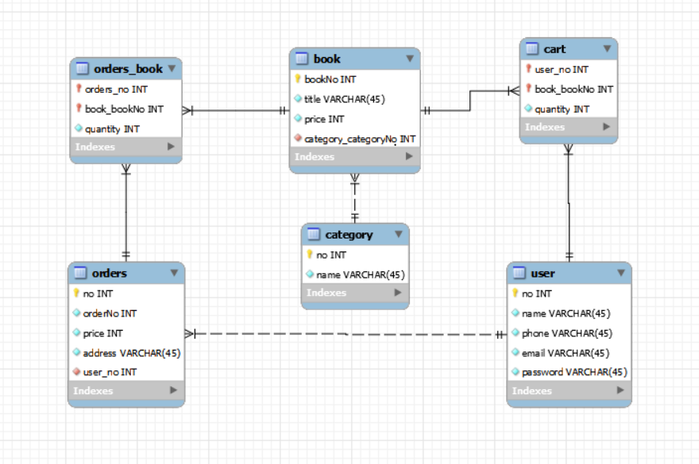

# ERD



# model 파일 위치

- bookmall.model 패키지 안에 위치해 있습니다.

# 실행방법

1. bookmall.main 패키지에 `BookMallMain.java` 파일이 있습니다.
2. 해당 `java`파일의 아래 코드에서 `ip`만 바꾸시면 쉽게 실행 해보실 수 있습니다.

```
private static final String DRIVER = "org.mariadb.jdbc.Driver";
    private static final String URL = "jdbc:mariadb://192.168.0.174:3307/bookmall?charset=utf8";
    private static final String USER = "bookmall";
    private static final String PASSWORD = "bookmall";

    public static Connection getConnection() throws ClassNotFoundException, SQLException {
        Class.forName(DRIVER);
        return DriverManager.getConnection(URL, USER, PASSWORD);
    }
```

# 결과화면

```
## 회원 리스트 ##
이름: 안대혁|전화번호: 010-1234-1234|이메일: bit1@bit.com|비밀번호: bitbit1
이름: 김종혁|전화번호: 010-1234-2345|이메일: bit2@bit.com|비밀번호: bitbit2

## 카테고리 리스트 ##
카테고리 번호: 1|카테고리 이름: 역사/문화
카테고리 번호: 2|카테고리 이름: IT
카테고리 번호: 3|카테고리 이름: 인문

## 도서 리스트##
책 제목: 총,균,쇠|책 가격: 30000원
책 제목: 이것이 Java다|책 가격: 40000원
책 제목: 무소유|책 가격: 15000원

## 카트 리스트##
도서 명: 총,균,쇠|수량: 1|가격: 30000원
도서 명: 이것이 Java다|수량: 1|가격: 40000원

## 주문 리스트##
주문자 이름 :안대혁, 전화번호: 010-1234-1234, 주문 번호: 2023090601, 총 가격: 70000원, 주소: 비트교육센터

## 주문 도서 리스트 ##
책 제목: 총,균,쇠|책 수량: 1|권당 가격:30000원
책 제목: 이것이 Java다|책 수량: 1|권당 가격:40000원
```
